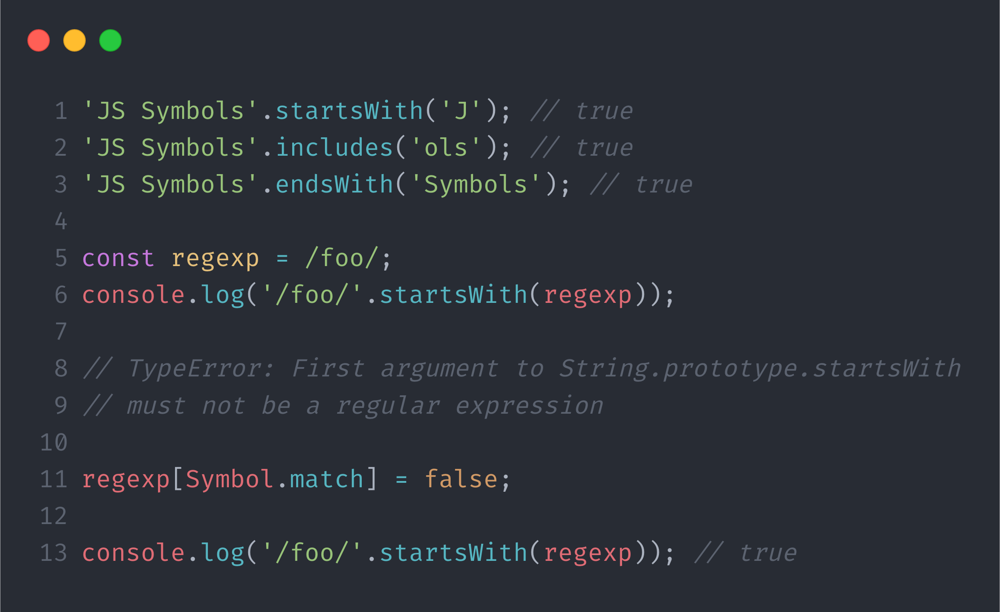

<style>
:root {
  --red: #e53935;
  --blue: #1E88E5;
  --yellow: #f7df1e;
  --purple: #EA80FC;
  --grey: #757575;
}

.title {
  position: absolute;
  top: 75px;
  left: 75px;
  font-size: 20px;
  color: var(--grey);
  font-weight: bold;
}
</style>
<style scoped>
  p {
    text-align: right;
    font-size: 20px;
    margin-top: 100px;
  }
</style>

#  Symbols

```js
Object.prototype[Symbol.iterator] = function* () {
  for (key of Object.keys(this)) yield [key, this[key]];
};
```

---

<style scoped>
  li {
    font-size: 35px;
  }
  p {
    display: flex;
    align-items: center;
    justify-content: space-around;
  }
</style>


<div>
  <span style="color: var(--red)">narghev</span>
  <span style="color: var(--blue)">:~$ </span>
  <span style="color: white">whoami</span>
</div>

```js
{
  fullName: "Narek Ghevandiani",
  company: "Hearme.app",
  technologies: [
    "Node.js",
    "React-Native",
    "GraphQL",
    "TypeScript"
  ],
  username: "narghev"
}
```

[](https://twitter.com/narghev) [](https://www.linkedin.com/in/narghev/) [](https://github.com/narghev) [](https://medium.com/@narghev)

---

<style scoped>
  li {
    font-size: 30px;
    list-style: none;
  }
  li::before {
    content: "•";
    color: orange;
    display: inline-block;
    width: 1em;
    margin-left: -1em
  }
</style>

<span class="title">Talk Coverage</span>

##  Symbols

- Definition
- Motivation
- Problem solved?
- <span style="color: var(--red)">Ruby</span> vs <span style="color: var(--yellow)">JavaScript</span> symbols
- Well-known JavaScript symbols
- Benefits

---

<span class="title">Definition</span>

###  Symbol

- Primitive DataType
- Added in 2015 with <span style="color: var(--blue)">**ES6**</span>
- to act as a unique identifier of object properties
  - <span style="font-size: 25px;">**_Imagine_** _Big random numbers (uuid) as keys of an object_</span>

---

<span class="title">Definition</span>


---

<span class="title">Definition</span>

Note: <span style="color: var(--blue)">Symbol</span> is <span style="color: var(--red)">**NOT**</span> a constructor and <span style="color: var(--red)">**CANNOT**</span> be called with new

## 

---

<span class="title">Definition</span>

#### Global symbol registry


---

<span class="title">Definition</span>

#### Global symbol registry


---

<span class="title">Motivation</span>

### The purpose of <span style="color: var(--blue)">Symbol</span>

- Enable private properties in <span style="color: var(--yellow)">JavaScript</span>
  - <span style="font-size: 25px;">_Before symbols: closures, proxies, and other workarounds_</span>
  - <span style="font-size: 25px;">_All of the solutions are too verbose and require a lot of code and logic to achieve their purpose_</span>

---

<span class="title">Motivation</span>

#### Using <span style="color: var(--blue)">Symbol</span> as a key


---

<span class="title">Motivation</span>

#### Comparing <span style="color: var(--blue)">Symbol</span>s


---

<span class="title">Motivation</span>

#### Accessing <span style="color: var(--blue)">Symbol</span>s


---

<span class="title">Motivation</span>

#### Comparing Global <span style="color: var(--blue)">Symbol</span>s


---

<span class="title">Motivation</span>

# Recap

- Primitive Data Type
- Unique Values
- Property Key
- Weak Encapsulation

---

<span class="title">Problem Solved?</span>

Okay, so <span style="color: var(--blue)">**Symbol**</span>s are cool. They help us make <span style="color: var(--red)">**unique**</span> values that can never be repeated and use them to hide properties.

<span style="font-size: 50px; color: var(--yellow)">**_But do they really solve the privacy problem?_**</span>

---

<span class="title">Problem Solved?</span>

#### <span style="color: var(--yellow)">JavaScript</span> symbol does <span style="color: var(--red); font-size: 80px;">NOT</span> achieve property privacy.

```js
Object.getOwnPropertySymbols();
```


---

<span class="title">Ruby vs JS symbols</span>

### **Symbol in computer programming**

> A symbol in computer programming is a primitive data type whose instances have a unique human-readable form.

---

<span class="title">Ruby vs JS symbols</span>

### <span style="color: var(--red)">Ruby</span> &#8195;Symbols


---

<span class="title">Ruby vs JS symbols</span>

### <span style="color: var(--yellow)">JavaScript</span> vs <span style="color: var(--red)">Ruby</span>

- We can replicate the Ruby symbol behavior by creating a symbol in the global symbol registry.
- Ruby symbols can be used instead of strings

---

<span class="title">Ruby vs JS symbols</span>

### <span style="color: var(--red)">Ruby</span> Symbol Usecases

- As property identifier
- Functions returning symbol indicating status `(:ok, :error)`
  - In <span style="color: var(--red)">Rails</span> almost all HTTP status codes are available as symbols `:ok, :internal_server_error or :not_found`.

---

<span class="title">Ruby vs JS symbols</span>

Symbols are <span style="color: var(--red); font-size: 60px;">NOT</span> the same and do <span style="color: var(--red); font-size: 60px;">NOT</span> share the same purpose in all programming languages.

<span style="font-size: 27px; position: absolute; left: 50px; bottom: 50px;">_Note: In some programming languages <span style="color: var(--purple)">**(erlang, elixir)**</span>, symbol is called an atom._</span>

---

<span class="title">Known JS Symbols</span>

### Well-known <span style="color: var(--yellow)">JavaScript</span> symbols

- `Symbol.iterator`
- `Symbol.match`
- `Symbol.toPrimitive`

---

<span class="title">Known JS Symbols</span>

### `Symbol.iterator`


---

<span class="title">Known JS Symbols</span>

### `Symbol.iterator`

> <span style="color: var(--yellow)">function\*() {}</span> is the syntax for defining a <span style="color: var(--red)">generator function</span>. A generator function returns a Generator object.

> <span style="color: var(--yellow)">yield</span> is a keyword used to <span style="color: var(--red)">pause</span> and <span style="color: var(--red)">resume</span> generator functions.

<span style="font-size: 35px;">_For async iteration there is <span style="color: var(--blue)">Symbol.asyncIterator</span> which is used by for await…of loop_</span>

---

<span class="title">Known JS Symbols</span>

### `Symbol.match`



---

<span class="title">Known JS Symbols</span>

### `Symbol.match`


---

<span class="title">Known JS Symbols</span>

### `Symbol.toPrimitive`


---

<span class="title">Benefits</span>

# Benefiting from <span style="color: yellow;">JavaScript</span> symbols

---

<span class="title">Benefits</span>

### **toPrimitive**


---

<span class="title">Benefits</span>

### **Iterator**


---

<span class="title">Benefits</span>

### **Object Metadata**


---

### **Object Metadata and avoiding property name collision**


---

# **Thank You!**

### _Questions?_

<span style="color: var(--blue); font-weight: bold;">@narghev</span>

<span style="font-size: 15px; color: var(--grey);">Check out the JS symbols article on my medium</span>


